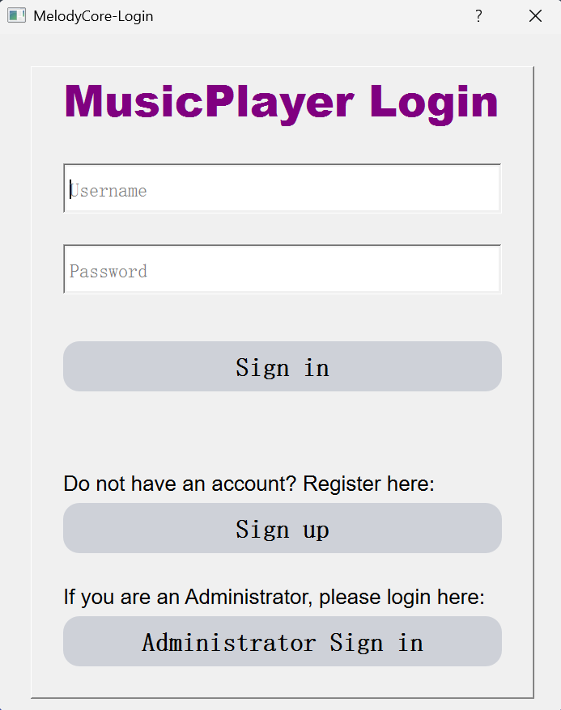
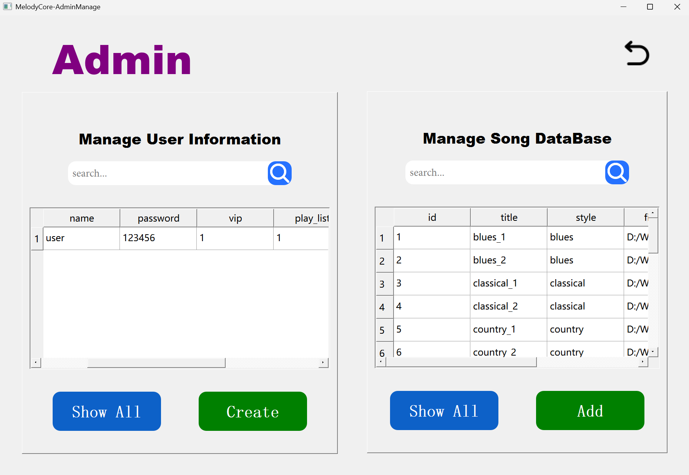
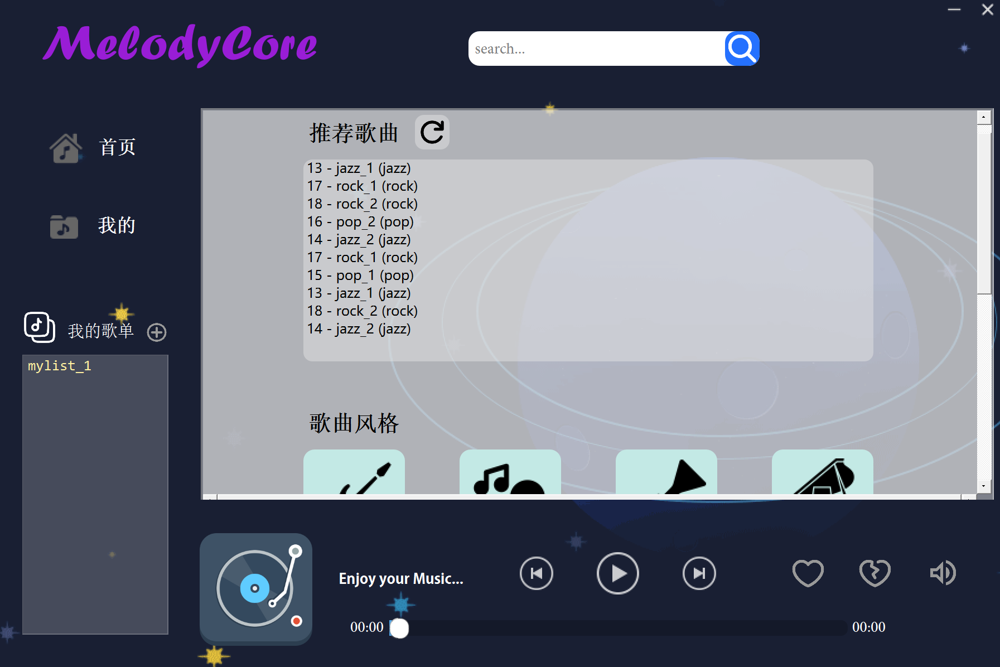
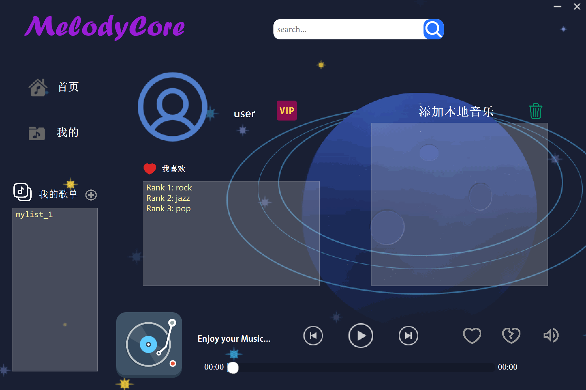

# MelodyCore - Qt 本地音乐播放器

> 一个基于 **C++ & Qt** 开发的桌面音乐播放器，专为高校学生、C++ 初学者和 Qt 爱好者设计。本项目不仅是一个功能完整的播放器，更是一份涵盖数据库操作、多线程、信号与槽、Model/View 架构等核心知识点的实战范例。

---

## 目录

- [核心功能](#核心功能)
- [截图预览](#截图预览)
- [技术栈](#技术栈)
- [项目结构](#项目结构)
- [环境依赖与编译指南](#环境依赖与编译指南)
- [快速开始](#快速开始)
- [许可证](#许可证)

---

## 核心功能

| 模块 | 功能描述 |
|------|----------|
| **本地音乐播放** | 支持 `mp3`, `wav` 等主流音频格式；<br />通过 `QMediaPlayer` 实现播放、暂停、停止、音量调节、进度拖拽 |
| **曲库管理** | 内置 SQLite 数据库，自动扫描 `music/` 目录并按风格（摇滚/流行/爵士等）归类入库 |
| **风格歌单** | 一键切换不同音乐风格（Rock, Pop, Jazz, Classical, Hip-hop 等） |
| **智能推荐** | 基于用户"喜欢/不喜欢"行为，动态调整风格偏好向量，实现个性化歌曲推荐 |
| **歌单系统** | 支持用户创建自定义歌单，支持重命名、删除、添加歌曲到歌单 |
| **VIP 模拟** | 模拟会员体系：非 VIP 用户无法播放标记为 VIP 的曲库歌曲 |
| **播放控制** | 上一首 / 下一首、播放列表循环、实时进度条与时间显示 |

---

## 截图预览

**1. 登录页面**：

<div align="center">
  
</div>

**2. 管理员页面**：

<div align="center">
  
</div>

**3. 首页主页面**：

<div align="center">
  
</div>

**4. 个人页面**：

<div align="center">
  
</div>

---

## 技术栈

- **语言**: C++11
- **GUI 框架**: Qt 5.12+ (Widgets, Multimedia, SQL)
- **数据库**: SQLite (通过 Qt SQL 模块本地集成)
- **多媒体**: `QMediaPlayer` + `QMediaPlaylist`
- **并发**: `QThread` + `moveToThread()` 实现后台时间格式化
- **构建工具**: qmake (`.pro`)

---

## 项目结构

```text
MusicPlayer4/
|
├── MusicPlayer4.pro          # qmake 项目配置文件
├── main.cpp                   # 程序入口：初始化数据库、加载默认歌曲、启动登录窗口
|
├── widget.h / widget.cpp      # 主界面逻辑：播放控制、歌单展示、推荐算法、用户交互
├── musicplayer.h / musicplayer.cpp     # 曲库播放器（数据库歌曲）：独立 DB 连接
├── mymusicplayer.h / mymusicplayer.cpp   # 本地播放器（本地文件）：支持进度控制
├── mythread.h / mythread.cpp    # 子线程：将秒数格式化为 mm:ss 时间字符串
|
├── userlogin.h / userlogin.cpp / userlogin.ui    # 用户登录对话框
├── userregister.h / userregister.cpp       # 用户注册对话框
├── adminlogin.h / adminlogin.cpp         # 管理员登录对话框
├── adminwidget.h / adminwidget.cpp        # 管理员后台管理界面
|
├── myQSS.h                    # 全局 QSS 样式定义（按钮、列表、滑块等）
├── images.qrc                 # Qt 资源文件：图标、GIF 背景图
|
├── music/                     # 默认曲库目录（按风格分子目录）
|   ├── rock/
|   ├── pop/
|   ├── jazz/
|   ├── classical/
|   ├── hiphop/
|   ├── electronic/
|   ├── country/
|   ├── folk/
|   └── blues/
|
├── pic/                       # UI 资源图片
└── include/                   # 第三方或本地头文件目录
```

### 关键文件说明

| 文件 | 职责 |
|------|------|
| `main.cpp` | 初始化 `music.db` SQLite 数据库（自动建表 + 填充默认歌曲），启动登录流程 |
| `widget.cpp` | 处理所有用户交互、播放状态机、推荐算法、SQL 查询与数据展示 |
| `musicplayer.cpp` | 封装曲库播放逻辑，每个实例拥有独立的数据库连接名，避免连接冲突 |
| `mymusicplayer.cpp` | 封装本地文件播放逻辑，提供进度百分比计算与音量控制接口 |
| `mythread.cpp` | 通过信号/槽与主线程通信，将原始秒数转换为 `mm:ss` 格式供 UI 显示 |

---

## 环境依赖与编译指南

### 1. 前置要求

- **Qt 版本**: Qt 5.12 或更高版本（推荐 Qt 5.14+）
- **编译器**: MSVC 2017/2019/2022 (Windows) 或 MinGW 7.3+ (Windows) 或 GCC (Linux/macOS)
- **必要 Qt 模块**:
  - `core`
  - `gui`
  - `widgets`
  - `multimedia`
  - `sql`

> 安装 Qt 时，请确保勾选了 **Qt Multimedia** 和 **Qt SQL** 组件。

### 2. 通过 Qt Creator 编译

```bash
# Step 1: 克隆仓库
git clone https://github.com/LtxChara/qt-music-player.git
cd MusicPlayer4

# Step 2: 用 Qt Creator 打开项目
# 双击 MusicPlayer4.pro 文件，或在 Qt Creator 中选择 "打开项目..."

# Step 3: 配置套件 (Kit)
# 选择与你的 Qt 版本匹配的编译器套件（如 Desktop Qt 5.14.2 MSVC2017 64bit）

# Step 4: 构建并运行
# 点击左下角的 "运行" 按钮（绿色三角形），或按 Ctrl+R
```

### 3. 命令行编译

```bash
# Windows (MSVC)
"C:\Program Files\Microsoft Visual Studio\2022\Community\VC\Auxiliary\Build\vcvarsall.bat" x64
qmake MusicPlayer4.pro
nmake -f Makefile.Release

# Windows (MinGW)
qmake MusicPlayer4.pro
mingw32-make -f Makefile.Release

# Linux / macOS
qmake MusicPlayer4.pro
make
```

### 4. 运行

编译成功后，可执行文件位于构建输出目录（如 `release/MusicPlayer4.exe`）。

> **首次运行**会自动在项目目录生成 `music.db` 数据库文件，并将 `music/` 目录下的默认歌曲扫描入库。

---

## 快速开始

1. 编译并运行程序。
2. 在登录界面使用默认测试账号登录：
   - **用户名**: `user`
   - **密码**: `123456`
3. 进入主界面后，点击 **"推荐歌曲"** 或任意 **"风格按钮"**（如 摇滚/流行）。
4. 双击列表中的歌曲即可播放。
5. 点击底部 **爱心图标** 标记"喜欢"，系统将自动更新你的风格偏好并影响后续推荐。

---

## 许可证

本项目基于 [MIT License](LICENSE) 开源，你可以自由学习、修改和分发。

```
MIT License

Copyright (c) 2026 Tianxiang Li

Permission is hereby granted, free of charge, to any person obtaining a copy
of this software and associated documentation files (the "Software"), to deal
in the Software without restriction, including without limitation the rights
to use, copy, modify, merge, publish, distribute, sublicense, and/or sell
copies of the Software, and to permit persons to whom the Software is
furnished to do so, subject to the following conditions:

The above copyright notice and this permission notice shall be included in all
copies or substantial portions of the Software.
```

---

> 如果你在学习过程中有任何问题，欢迎提交 [Issue](https://github.com/[YourUsername]/MusicPlayer4/issues) 或 [Pull Request](https://github.com/[YourUsername]/MusicPlayer4/pulls)。祝你学习愉快！
>
> ⭐ 如果这个项目对你有帮助，欢迎 Star 支持！
